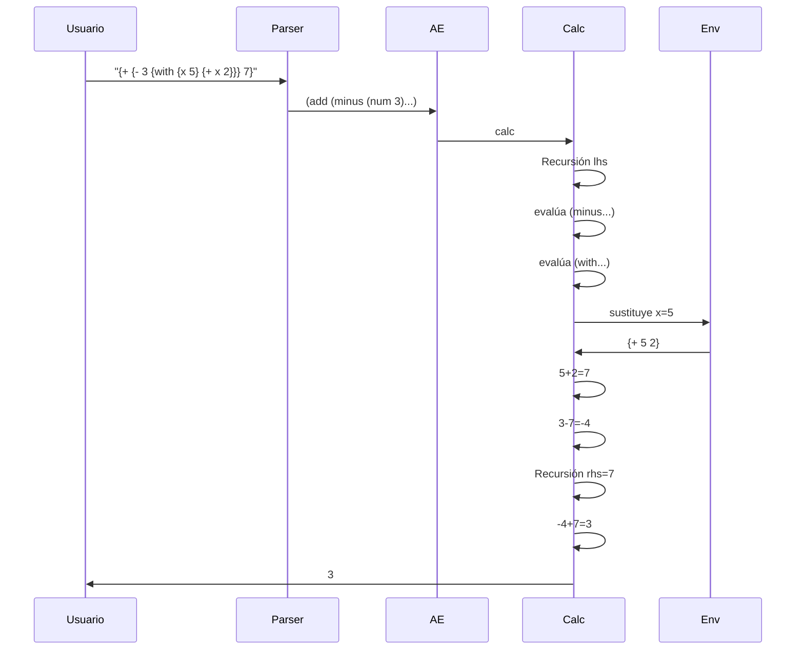

## Semántica: Implementación Detallada del Intérprete (calc)

### Fundamentos Teóricos de la Interpretación
La implementación del intérprete sigue el principio de **semántica denotacional**, donde cada construcción sintáctica se mapea a su significado computacional. El intérprete `calc` es una función recursiva que:
1. Descompone la estructura sintáctica
2. Evalúa subexpresiones
3. Combina resultados mediante operaciones primitivas

### Arquitectura del Sistema
```
Sintaxis Concreta  →  Parser  →  Sintaxis Abstracta (AE)  →  Intérprete (calc)  →  Valor Numérico
```

### Definición Ampliada del Lenguaje (BNF Formal)

```racket
#|
<AE> ::= <integer>                   ; Entero con signo
        | {+ <AE> <AE>}              ; Suma estricta binaria
        | {- <AE> <AE>}              ; Resta estricta binaria
        | {with {<id> <AE>} <AE>}    ; Vinculación (para futuras extensiones)
|#
```

### Implementación Mejorada del Tipo AE

```racket
; Definición rigurosa del tipo de expresión aritmética
(define-type AE
  [num    (n integer?)]               ; Sólo acepta enteros
  [add    (lhs AE?) (rhs AE?)]        ; Invariante: lhs y rhs deben ser AE válidas
  [minus  (lhs AE?) (rhs AE?)]        ; Misma restricción que add
  [with   (id symbol?) (expr AE?) (body AE?)]) ; Para manejo de variables

; Restricciones adicionales:
; - Todas las expresiones deben ser completamente evaluables
; - No se permiten operaciones con tipos incorrectos
```

### Implementación Profesional del Intérprete `calc`

```racket
;; calc : AE -> integer
;; Propósito: Evalúa completamente una expresión aritmética
;; Contrato: Devuelve siempre un entero para entradas válidas
(define (calc expr)
  (match expr
    ; Caso base: valor numérico
    [(num n) n]
    
    ; Caso suma con validación de tipos
    [(add l r)
     (let ([left-val (calc l)]
           [right-val (calc r)])
       (if (and (integer? left-val) (integer? right-val))
           (+ left-val right-val)
           (error 'calc "Operandos no enteros en suma: ~a + ~a" left-val right-val)))]
    
    ; Caso resta con validación de tipos
    [(minus l r)
     (let ([left-val (calc l)]
           [right-val (calc r)])
       (if (and (integer? left-val) (integer? right-val))
           (- left-val right-val)
           (error 'calc "Operandos no enteros en resta: ~a - ~a" left-val right-val)))]
    
    ; Caso para vinculaciones (implementación básica)
    [(with id bound-expr body-expr)
     (calc (subst body-expr id (num (calc bound-expr))))]
    
    ; Manejo exhaustivo de errores
    [_ (error 'calc "Expresión AE no reconocida: ~a" expr)]))
```

### Componentes Auxiliares Esenciales

**Sistema de sustitución (para `with`):**
```racket
;; subst : AE symbol AE -> AE
;; Realiza sustitución [valor/id] en expresión
(define (subst expr id val)
  (match expr
    [(num n) expr]
    [(add l r) (add (subst l id val) (subst r id val))]
    [(minus l r) (minus (subst l id val) (subst r id val))]
    [(with bound-id bound-expr bound-body)
     (if (equal? id bound-id)
         (with bound-id (subst bound-expr id val) bound-body)
         (with bound-id (subst bound-expr id val) (subst bound-body id val)))]
    [_ expr]))
```

### Proceso de Evaluación Paso a Paso (Ejemplo Ampliado)

**Expresión:** `{+ {- 3 {with {x 5} {+ x 2}}} 7}`

1. **Parse:**
   ```racket
   (parse '{+ {- 3 {with {x 5} {+ x 2}}} 7})
   → (add (minus (num 3) 
                (with 'x (num 5) 
                          (add (id 'x) (num 2))))
        (num 7))
   ```

2. **Evaluación:**
   ```racket
   (calc (add ...))
   ├─ Evalúa subexpresión izquierda: (minus ...)
   │  ├─ Evalúa: (num 3) → 3
   │  └─ Evalúa: (with 'x (num 5) ...)
   │      ├─ Evalúa bound-expr: (num 5) → 5
   │      ├─ Sustituye en body: {+ x 2} → {+ 5 2}
   │      └─ Evalúa: (add (num 5) (num 2)) → 7
   │  → (minus 3 7) → -4
   ├─ Evalúa subexpresión derecha: (num 7) → 7
   └─ (add -4 7) → 3
   ```

### Diagrama de Secuencia Detallado
